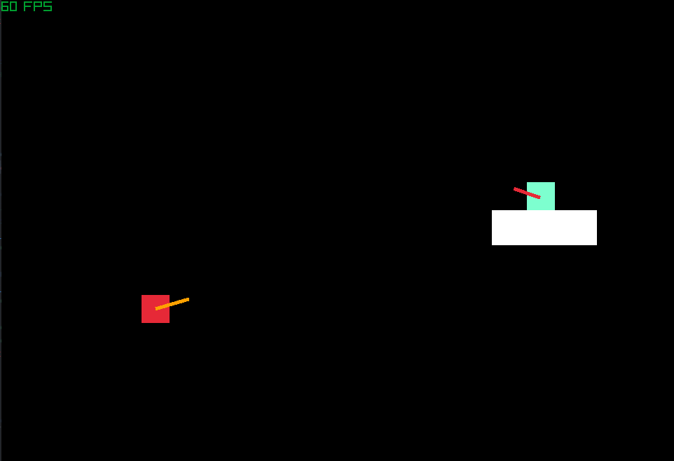

# THE GAME
The game is inspired by Dani's first ludum dare entry (game called Fair 'n square). My game howered puts more emphasis on turn-based gameplay

# DEVELOPMENT ROADMAP
## WEAPONS
- laser
-rocket launcher
- granade launcher
- magic staff
## ENEMIES
- improve enemy AI
- add more enemies
## game loop
- keeping track of how many enemies you have killed
- wave-based gameplay with buying weapons and abilities after each round(?)
- random terrain generation
-small game map

### The order of tasks
- adding the 5 wepons listed
- adding random terrain generation
- adding wave based gameplay
-adding a game map in the top-left corner
- adding the ability to buy weapons
- adding more enemies
- adding abilities (?)

